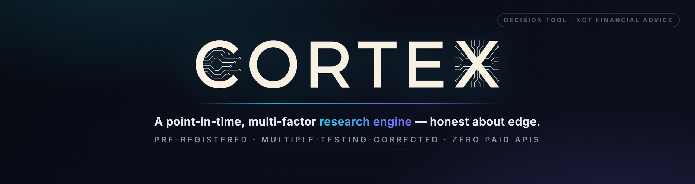
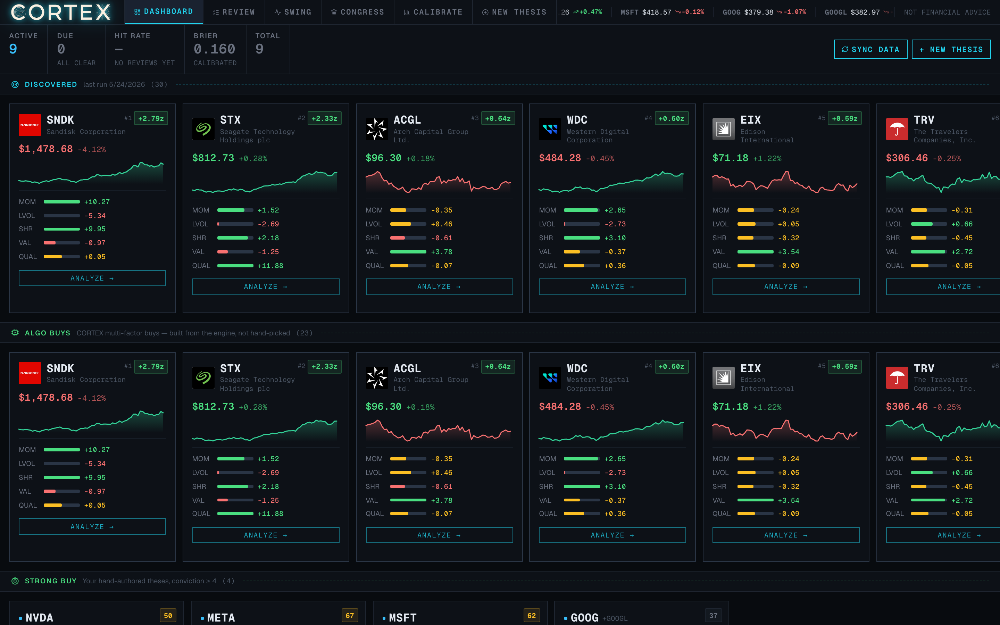
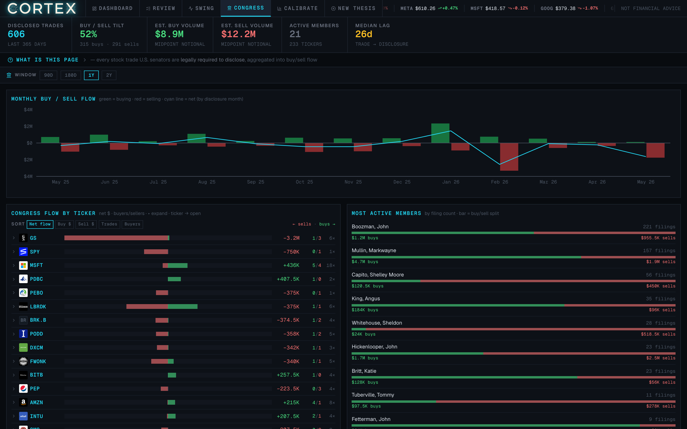
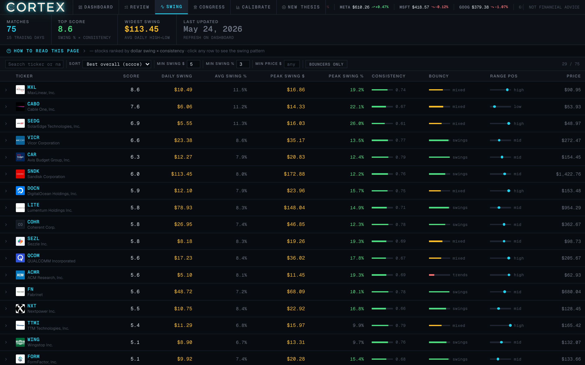
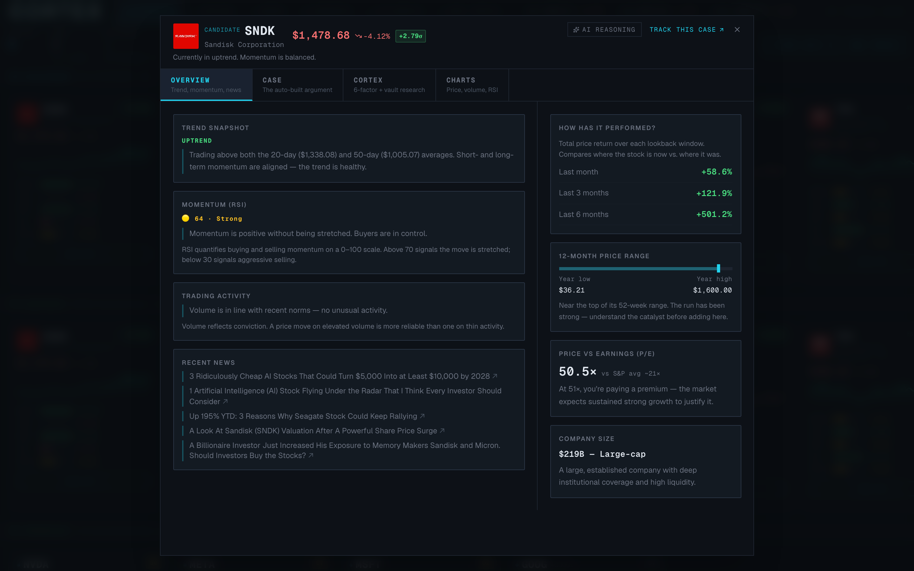
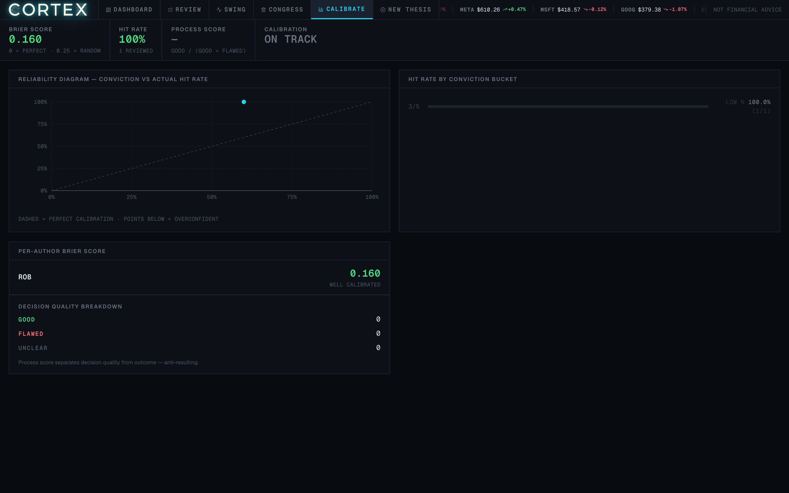

<p align="center">
  
</p>

<p align="center">
  <b>A factor-model research platform that treats investing as a calibrated decision process — not a signal feed.</b><br/>
  <i>Every number on screen is evidence for a decision. Never a recommendation.</i>
</p>

<p align="center">
  <a href="https://www.python.org/"></a>
  <a href="https://fastapi.tiangolo.com/"></a>
  <a href="https://duckdb.org/"></a>
  <a href="web/"></a>
  
  
  <a href="LICENSE"></a>
</p>

---

## The 60-second pitch

Most retail "stock tools" optimise for action — buy buttons, green arrows, dopamine. **CORTEX optimises for the opposite:** slower, better-calibrated decisions, and intellectual honesty about edge.

It is a single-operator quantitative research platform built end-to-end: a point-in-time multi-factor engine over the S&P universe, an alt-data ingestion layer sourced **entirely from free public filings**, a decision-quality system that scores the operator's own forecasting calibration, and a glass-premium React portal — all served from one Python process.

It is deliberately **honest about what it has and hasn't found.** The backtest harness holds every candidate factor to a pre-registered, multiple-testing-corrected significance bar, and refuses to dress up noise as alpha. As of the latest run, **no factor clears the bar — so nothing trades live.** That restraint is the point.

> **For reviewers:** build the portal (`cd web && npm install && npm run build`), then `uv run cortex serve` and open `http://127.0.0.1:8000`. The walkthrough below mirrors what you'll see.

---

## The command center

> *A dark-only, anti-action-bias dashboard. Gains and losses render in muted green/red on purpose — the UI signals direction, never excitement.*

<p align="center">
  
</p>

The dashboard opens on the **CORTEX-ranked universe**: every candidate carries a composite z-score and a per-factor breakdown — momentum, low-vol, Sharpe, value, quality — rendered as live meters. **DISCOVERED** is the raw screen; **ALGO BUYS** are the engine's multi-factor picks, *built from the model, not hand-selected*; **STRONG BUY** holds your own hand-authored theses at conviction ≥ 4. The top strip carries calibration KPIs (Brier score, hit rate, review count) so decision quality is always in view.

---

## Congressional trade flow

> *Every U.S. senator is legally required to disclose their trades. CORTEX aggregates the whole feed into buy/sell pressure.*

<p align="center">
  
</p>

Disclosed trades are ingested from public Senate eFD filings and rolled into **monthly net buy/sell flow**, **per-ticker pressure**, and a **most-active-members** leaderboard with a buy/sell split. The median disclosure lag is surfaced directly — because alt-data that arrives 26 days late is a very different signal than one that arrives same-day, and the platform refuses to hide that.

---

## The volatility / dollar-swing screen

> *Rank the universe by how much it actually moves — average daily swing, peak swing, consistency, and range position.*

<p align="center">
  
</p>

A trading-oriented screen that scores each name on **dollar-swing magnitude, consistency, and where it sits in its range** — for sizing and timing decisions rather than long-horizon conviction. Sortable, filterable, and wired into the same per-ticker analysis as everything else.

---

## The CORTEX case — per ticker

> *Click any candidate. The auto-built case shows the factor evidence, the trend snapshot, performance, and a falsifier — before you ever form an opinion.*

<p align="center">
  
</p>

Each ticker opens a four-tab workspace: **Overview** (trend, momentum, trading activity, recent news), **Case** (the auto-built bull/risk argument with per-point z-scores), **CORTEX** (the 5-factor decomposition plus retrieved vault research), and **Charts** (price, volume, RSI). The *AI Reasoning* path grounds its analysis in locally-embedded research notes — no external embedding API.

---

## Decision quality & calibration

> *You must state in advance what would prove you wrong. Then the platform scores how well-calibrated you actually are.*

<p align="center">
  
</p>

Investing decisions are logged as **theses** with a required, explicit *falsifier* and a *review date*. A calibration engine then scores forecasting using **Brier scores** and per-conviction hit-rate buckets, plotting a reliability diagram that flags systematic over-confidence. A **process score** separates decision *quality* from outcome — a good decision with a bad result is still a good decision. A review queue surfaces theses whose review date has passed.

---

## Architecture

```
                    ┌─────────────────────────────────────────────┐
                    │  React + Vite + TS portal  (web/)            │
                    │  glass-premium UI · TanStack Query · charts  │
                    └───────────────────────┬─────────────────────┘
                                            │  one origin, port 8000
                    ┌───────────────────────┴─────────────────────┐
                    │  FastAPI service  (src/cortex/api.py)        │
                    │  serves the built SPA + a typed JSON API     │
                    └───────────────────────┬─────────────────────┘
          ┌─────────────────┬───────────────┼───────────────┬─────────────────┐
          │                 │               │               │                 │
   ┌──────┴──────┐  ┌───────┴──────┐ ┌──────┴──────┐ ┌──────┴──────┐ ┌────────┴───────┐
   │ CORTEX      │  │ Decision     │ │ RAG /        │ │ Alt-data     │ │ Backtest /     │
   │ factor      │  │ quality      │ │ research     │ │ ingestion    │ │ pre-registered │
   │ engine      │  │ (theses,     │ │ (fastembed + │ │ (EDGAR,      │ │ OOS harness    │
   │             │  │  calibration)│ │  DuckDB VSS) │ │  Senate eFD) │ │                │
   └──────┬──────┘  └───────┬──────┘ └──────┬──────┘ └──────┬──────┘ └────────┬───────┘
          └─────────────────┴───────────────┴───────────────┴─────────────────┘
                                            │
                              ┌─────────────┴─────────────┐
                              │  DuckDB  (columnar store  │
                              │  + VSS HNSW vector index) │
                              └───────────────────────────┘
```

**Stack:** Python 3.12 · FastAPI · DuckDB (analytics + native vector search) ·
fastembed (local embeddings) · scikit-learn · React 18 · Vite · TypeScript ·
TanStack Query · lightweight-charts · Recharts. Tooling: `uv`, `ruff`, `pyright`.

The whole thing runs as one command (`cortex serve`) on `127.0.0.1` — the API and the
compiled SPA share a single origin and process.

---

## What's inside

### CORTEX — point-in-time multi-factor engine

A composite equity-ranking engine over the S&P universe. Factors are computed from
**point-in-time** inputs (no lookahead) and standardised cross-sectionally each period:

| Factor   | Intuition                              | Source              |
|----------|----------------------------------------|---------------------|
| Momentum | 12-1 trailing return                   | Market prices       |
| Low-vol  | Inverse realised volatility            | Market prices       |
| Sharpe   | Risk-adjusted trailing return          | Market prices       |
| Value    | Earnings yield                         | EDGAR XBRL (PIT)    |
| Quality  | Return on equity / capital efficiency  | EDGAR XBRL (PIT)    |

Plus **alternative-data factors** ingested from public disclosures: congressional
trading flow, Form 4 insider open-market buys, 13F institutional fund flow, and 13D
activist stakes. The exact composite weighting is intentionally not documented here.

### Pre-registered backtest harness

The differentiator. `cortex backtest` and `cortex congress-oos` evaluate factors against a
**pre-registered hypothesis and an out-of-sample window**, and apply a
multiple-testing-corrected significance gate. A factor is only called "real" when its
information-coefficient t-statistic clears the bar — anything below is treated as noise.

Every reported t-statistic is **Newey–West HAC-adjusted** (Bartlett kernel), so the
significance bar is robust to autocorrelation in the monthly IC series rather than
assuming IID months. Alongside the per-factor ablation the harness reports:

- **The long–short spread** — top-decile-minus-bottom-decile return of the composite,
  which strips market beta to isolate the factor's directional content (a long-only
  decile mostly inherits the market's drift).
- **A factor-IC correlation matrix** — answering whether the alt-data flow factors
  (congressional / insider / 13F) carry information *beyond* price momentum, or merely
  re-express it. (They turn out to be weakly correlated with the price factors — the
  flow thesis is additive, not redundant.)

The harness explicitly reports its own caveats (survivorship bias from a
current-membership universe, sparse coverage on alt-data factors, transaction-cost
assumptions) **in the output itself**. As of the latest run no candidate factor clears
the bar, so the platform does no live trading. Honest negative results, surfaced rather
than buried.

---

## Data engineering notes (hard-won)

Free public filing systems are gloriously undocumented. A few things this codebase gets
right that most tutorials get wrong:

- **SEC Form 4 filenames are not standardised.** `form4.xml` only resolves for ~half of
  filers; filing agents use custom names. The canonical resolution path is each filer's
  `submissions/CIK……json` → `primaryDocument`, stripping the XSLT rendering subdirectory
  to reach the actual data file.
- **Bulk index over per-company queries.** Insider/activism backfills parse SEC's
  quarterly `form.idx` bulk indexes rather than issuing hundreds of thousands of
  per-filing guesses — orders of magnitude fewer requests.
- **Rate-limit etiquette.** Bounded worker pools, exponential back-off on HTTP 429, and a
  compliant, configurable `User-Agent` keep ingestion within SEC fair-access limits.
- **Idempotent writes.** Every sync is safe to re-run: rows carry deterministic SHA-256
  dedup keys with `ON CONFLICT DO NOTHING`, so partial runs never duplicate or corrupt.
- **Fail visibly.** Skipped or degraded records are surfaced, never silently dropped.

---

## Quickstart

```bash
# 1. Install (Python 3.12, uv)
uv sync

# 2. Provide an SEC contact identity (required by SEC fair-access policy)
#    Set CORTEX_SEC_USER_AGENT to "Your Name your-email@example.com" in a .env file.

# 3. Initialise the columnar store
uv run cortex db-init

# 4. (optional) Ingest public data — all free sources
uv run cortex congress-sync          # Senate disclosures
uv run cortex insiders-sync          # Form 4 open-market buys
uv run cortex funds-sync             # 13F institutional flow
uv run cortex fundamentals-sync      # point-in-time EDGAR fundamentals

# 5. Rank the universe and check the evidence
uv run cortex discover               # CORTEX multi-factor ranking
uv run cortex backtest               # pre-registered factor evaluation

# 6. Build the portal and serve everything from one process
(cd web && npm install && npm run build)
uv run cortex serve                  # http://127.0.0.1:8000
```

### CLI surface

`db-init` · `new` · `review` · `calibration` · `mirror` · `rag-index` · `discover` ·
`vol-screen` · `congress-sync` · `funds-sync` · `funds-backfill` · `insiders-sync` ·
`activism-sync` · `fundamentals-sync` · `congress-oos` · `backtest` · `serve`

Run `uv run cortex <command> --help` for arguments.

### Configuration

All runtime config comes from the environment (or a local, git-ignored `.env`). Nothing
sensitive is committed.

| Variable                 | Purpose                                              |
|--------------------------|------------------------------------------------------|
| `CORTEX_SEC_USER_AGENT`  | SEC EDGAR contact identity (`Name email`) — required |
| `CORTEX_DUCKDB_PATH`     | Override the DuckDB path (must end in `.db`)         |
| `CORTEX_VAULT_DIR`       | Markdown mirror output directory                     |
| `CORTEX_RESEARCH_DIR`    | Research-note source for the RAG index               |
| `CORTEX_CLAUDE_BIN`      | Explicit path to the `claude` CLI (LLM analysis)     |
| `VITE_LOGODEV_TOKEN`     | Optional logo enhancement; UI falls back to monograms|

---

## Engineering quality

- **69 tests** concentrated on the pure-logic core — calibration math, thesis CRUD,
  storage, RAG, and the backtest's scoring helpers — plus HTTP-mocked data sources
  (`respx`). The ingestion, API, and CLI layers are exercised manually, not yet in the
  automated suite.
- **Clean static analysis:** `ruff check` and `ruff format` pass repo-wide; `pyright`
  (basic) reports zero errors across `src/`.
- **Strict tooling:** `ruff` (format + lint + isort), `pyright` (basic), `uv` lockfile.
- **Typed throughout:** `from __future__ import annotations`, `X | None` unions,
  dataclasses, Pydantic request models.
- **Idempotent, schema-versioned storage** with a migration table.

```bash
uv run pytest        # tests + coverage
uv run ruff check src/
uv run pyright src/
```

---

## Security & privacy posture

This repository is published as a portfolio piece and is hardened accordingly:

- **No secrets, no PII in source.** Contact identities, tokens, and machine-specific
  paths are read from the environment — never hardcoded. `.env*` files are both
  git-ignored and on a filesystem deny-list.
- **No data committed.** The DuckDB store, coverage artefacts, and caches are
  git-ignored; the repo ships code, not anyone's positions or research.
- **Local-only by default.** The server binds `127.0.0.1`; CORS is restricted to the
  local dev origin; the API is read-mostly with a small typed write surface.
- **Safe subprocess + DB access.** The LLM analysis path invokes the `claude` CLI with
  argument vectors (no shell string interpolation); all SQL uses parameterised queries.
- **Public data only.** Every external source is a free public disclosure feed (SEC
  EDGAR, Senate eFD) accessed within published rate-limit and fair-access policies.

---

## Disclaimer

CORTEX is a personal research and decision-support tool. It is **not financial advice**, it
does not execute trades, and it makes no recommendations. Nothing here is an offer or
solicitation. Markets are risky; past performance does not predict future results.

---

## License

**Source-available, all rights reserved.** This repository is published for portfolio
review and evaluation only. You may read the code; you may **not** copy, modify, reuse,
redistribute, or deploy it (in whole or in part) without prior written permission. See
[`LICENSE`](LICENSE) for the full terms.

© Rob Savage. All rights reserved.
